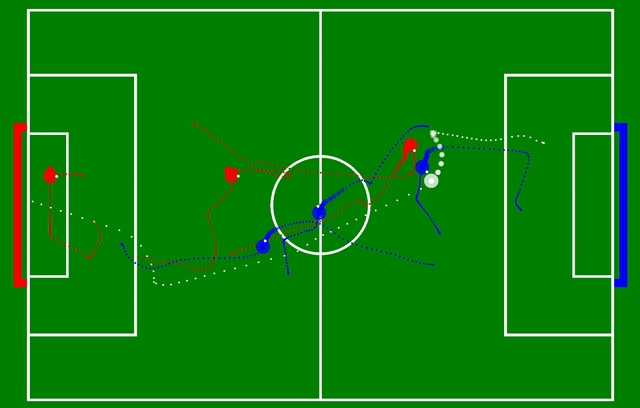

# MARLadona 
This repository contains the multi-agent training environment for the [MARLadona - Towards Cooperative Team Play Using Multi-Agent
Reinforcement Learning](https://arxiv.org/pdf/2409.20326) Paper.

The open-source version of the MARL soccer environment is built on top of IsaacLab and based on the [IsaacLabExtensionTemplate](https://github.com/isaac-sim/IsaacLabExtensionTemplate.git) 

This repository contains the multi-agent soccer environment `isaaclab_marl` as well as a heavyily modified `rsl_marl` training pipeline in implementation in `rsl_marl`. The original implementation as well as result from the paper are based on Isaac Gym. This migration effort were made due to the deprecation of Isaac Gym.        

<!--    -->
<!-- *Typical Gameplay in Isaaclab * -->
<figure>
  
  <figcaption><em>Typical Gameplay in Isaaclab</em></figcaption>
</figure>

<figure>
  
  <figcaption><em>Work great for any Agent Number (Isaac Gym)</em></figcaption>
</figure>

## Installation

- Install Isaac Sim and Lab by following the [installation guide](https://isaac-sim.github.io/IsaacLab/main/source/setup/installation/index.html). We recommend using the conda installation as it simplifies calling Python scripts from the terminal.

- Clone this repository separately from the Isaac Lab installation (i.e. outside the `IsaacLab` directory):

```bash
# Option 1: HTTPS
git clone https://github.com/leggedrobotics/marladona-isaac-lab.git

# Option 2: SSH
git clone git@github.com:leggedrobotics/marladona-isaac-lab.git
```

- Throughout the repository, the name `isaaclab_marl` only serves as an example and we provide a script to rename all the references to it automatically:

```bash
# Enter the repository
cd marladona-isaac-lab
```

- Using a python interpreter that has Isaac Lab installed, install the library

```bash
python -m pip install -e source/isaaclab_marl
python -m pip install -e source/rsl_marl
```

- Verify that the extension is correctly installed by running the following command:

```bash
python scripts/rsl_rl/train.py --task=Isaac-Soccer-v0 
```

An example policy is provided in the example_policy folder. You can test its performance by running the following command:

```bash
python scripts/rsl_rl/play.py --task=Isaac-Soccer-Play-v0 --load_run=24_09_28_11_56_41_3v3 
```
Note: The number of agents can be configured via the `SoccerMARLEnvPlayCfg` class.

### Useful Visualization Tools (Migration in Progress) ### 

## Trajectory Analyser ## 

## Value Function Visualizer ## 

### Set up IDE (Optional)

To setup the IDE, please follow these instructions:

- Run VSCode Tasks, by pressing `Ctrl+Shift+P`, selecting `Tasks: Run Task` and running the `setup_python_env` in the drop down menu. When running this task, you will be prompted to add the absolute path to your Isaac Sim installation.

If everything executes correctly, it should create a file .python.env in the `.vscode` directory. The file contains the python paths to all the extensions provided by Isaac Sim and Omniverse. This helps in indexing all the python modules for intelligent suggestions while writing code.

### Setup as Omniverse Extension (Optional)

We provide an example UI extension that will load upon enabling your extension defined in `source/isaaclab_marl/isaaclab_marl/ui_extension_example.py`.

To enable your extension, follow these steps:

1. **Add the search path of your repository** to the extension manager:
    - Navigate to the extension manager using `Window` -> `Extensions`.
    - Click on the **Hamburger Icon** (☰), then go to `Settings`.
    - In the `Extension Search Paths`, enter the absolute path to `IsaacLabExtensionTemplate/source`
    - If not already present, in the `Extension Search Paths`, enter the path that leads to Isaac Lab's extension directory directory (`IsaacLab/source`)
    - Click on the **Hamburger Icon** (☰), then click `Refresh`.

2. **Search and enable your extension**:
    - Find your extension under the `Third Party` category.
    - Toggle it to enable your extension.

## Docker setup

### Building Isaac Lab Base Image

Currently, we don't have the Docker for Isaac Lab publicly available. Hence, you'd need to build the docker image
for Isaac Lab locally by following the steps [here](https://isaac-sim.github.io/IsaacLab/main/source/deployment/index.html).

Once you have built the base Isaac Lab image, you can check it exists by doing:

```bash
docker images

# Output should look something like:
#
# REPOSITORY                       TAG       IMAGE ID       CREATED          SIZE
# isaac-lab-base                   latest    28be62af627e   32 minutes ago   18.9GB
```

### Building Isaac Lab Template Image

Following above, you can build the docker container for this project. It is called `isaac-lab-template`. However,
you can modify this name inside the [`docker/docker-compose.yaml`](docker/docker-compose.yaml).

```bash
cd docker
docker compose --env-file .env.base --file docker-compose.yaml build isaac-lab-template
```

You can verify the image is built successfully using the same command as earlier:

```bash
docker images

# Output should look something like:
#
# REPOSITORY                       TAG       IMAGE ID       CREATED             SIZE
# isaac-lab-template               latest    00b00b647e1b   2 minutes ago       18.9GB
# isaac-lab-base                   latest    892938acb55c   About an hour ago   18.9GB
```

### Running the container

After building, the usual next step is to start the containers associated with your services. You can do this with:

```bash
docker compose --env-file .env.base --file docker-compose.yaml up
```

This will start the services defined in your `docker-compose.yaml` file, including isaac-lab-template.

If you want to run it in detached mode (in the background), use:

```bash
docker compose --env-file .env.base --file docker-compose.yaml up -d
```

### Interacting with a running container

If you want to run commands inside the running container, you can use the `exec` command:

```bash
docker exec --interactive --tty -e DISPLAY=${DISPLAY} isaac-lab-template /bin/bash
```

### Shutting down the container

When you are done or want to stop the running containers, you can bring down the services:

```bash
docker compose --env-file .env.base --file docker-compose.yaml down
```

This stops and removes the containers, but keeps the images.

## Code formatting

We have a pre-commit template to automatically format your code.
To install pre-commit:

```bash
pip install pre-commit
```

Then you can run pre-commit with:

```bash
pre-commit run --all-files
```

## Troubleshooting

### Pylance Missing Indexing of Extensions

In some VsCode versions, the indexing of part of the extensions is missing. In this case, add the path to your extension in `.vscode/settings.json` under the key `"python.analysis.extraPaths"`.

```json
{
    "python.analysis.extraPaths": [
        "<path-to-ext-repo>/source/isaaclab_marl"
    ]
}
```

### Pylance Crash

If you encounter a crash in `pylance`, it is probable that too many files are indexed and you run out of memory.
A possible solution is to exclude some of omniverse packages that are not used in your project.
To do so, modify `.vscode/settings.json` and comment out packages under the key `"python.analysis.extraPaths"`
Some examples of packages that can likely be excluded are:

```json
"<path-to-isaac-sim>/extscache/omni.anim.*"         // Animation packages
"<path-to-isaac-sim>/extscache/omni.kit.*"          // Kit UI tools
"<path-to-isaac-sim>/extscache/omni.graph.*"        // Graph UI tools
"<path-to-isaac-sim>/extscache/omni.services.*"     // Services tools
...
```
